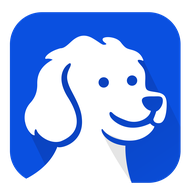
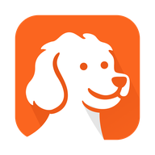

<div align="center">


<br></br>
<a href="https://discord.gg/YKwjt5vuKr"></a>
<a href="https://dub.sh/browserOS-slack"></a>
<a href="https://x.com/browserOS_ai"></a>
<a href="https://github.com/browseros-ai/BrowserOS"></a>
<br></br>

</div>

<table>
<tr>
<td width="50%" align="center" valign="top">



### BrowserClaw

**The browser for AI agents**

Claude Code, Codex, Cursor, or any MCP client drives it using the accounts you're already signed into, while you watch live and replay every step.

[](https://cdn.browseros.com/download/BrowserClaw.dmg)
[](https://cdn.browseros.com/download/BrowserClaw_installer.exe)

**[Website](https://www.browseros.com/agents)** · **[Docs](https://docs.browseros.com/browserclaw)**

</td>
<td width="50%" align="center" valign="top">



### BrowserOS

**The AI browser for humans**

An open-source Chromium fork with a built-in AI agent, the privacy-first alternative to ChatGPT Atlas, Perplexity Comet, and Dia.

[](https://files.browseros.com/download/BrowserOS.dmg)
[](https://files.browseros.com/download/BrowserOS_installer.exe)
[](https://files.browseros.com/download/BrowserOS.AppImage)
[](https://cdn.browseros.com/download/BrowserOS.deb)

**[Website](https://www.browseros.com)** · **[Docs](https://docs.browseros.com)**

</td>
</tr>
</table>

<div align="center">

**Two browsers, one codebase.** Free · Open source (AGPL-3.0) · Local-only · Bring your own AI keys

</div>

## BrowserClaw

**What is BrowserClaw?** BrowserClaw is a free, open-source browser your AI agents drive using your logged-in accounts. You install it like any browser, sign into the sites you use, and give tasks to Claude Code, Codex, Cursor, or any MCP-compatible AI. Your agents work in their own tabs while you watch every step live and replay any session like a video.

Your AI is smart, but it can't press the buttons. Ask it to book a flight, download an invoice, or reply to an email, and it stops at the login screen. BrowserClaw fixes that.

### Get started

1. **Install BrowserClaw and sign in** to the sites you use every day. It works like any browser, and every account you sign into becomes something your AI can use.
2. **Connect your AI in one click.** Claude Code, Codex, Cursor, VS Code, Zed, OpenCode, and Antigravity install with a single click; anything else that speaks MCP connects with a URL.
3. **Give it a real task.** In your AI chat: *"Find a good time next week for a 30-minute team meeting and send the invite."* Then watch it live from your new tab and replay the whole run like a video.

### Key features

<table>
<tr>
<td width="40%" valign="middle">
<h4>Live dashboard</h4>
Your new tab shows every agent working right now: which site it's on, what it's doing, how far along. <a href="https://docs.browseros.com/browserclaw/cockpit">Docs</a>
</td>
<td width="60%">

</td>
</tr>
<tr>
<td width="40%" valign="middle">
<h4>One-click MCP connect</h4>
One endpoint, every harness. Seven AI tools set up with a single click. <a href="https://docs.browseros.com/browserclaw/mcp">Docs</a>
</td>
<td width="60%">

</td>
</tr>
<tr>
<td width="40%" valign="middle">
<h4>Replay every session</h4>
Every session is saved as a scrubbable video on your disk with a step-by-step action timeline. Rewind and see exactly what happened. <a href="https://docs.browseros.com/browserclaw/audit-and-replay">Docs</a>
</td>
<td width="60%">

</td>
</tr>
</table>

- **Your logins.** Agents automate your real work using the sessions you already have, not a blank sandbox. [How it works](https://docs.browseros.com/browserclaw/how-it-works)
- **Local-only.** Sessions, screenshots, and history live under `~/.browserclaw/` and never leave your machine. [Privacy](https://docs.browseros.com/browserclaw/privacy)

### Why BrowserClaw over the alternatives?

- **Not a headless driver.** Playwright and browser-use spin up a fresh Chrome subprocess with no logins. Great for CI, useless for "book my flight" or "read my inbox." BrowserClaw is the browser your logins already live in.
- **Not a cloud browser.** Browserbase and Browser Use Cloud run your agent's session on someone else's infrastructure. Your prompts and session tokens pass through their servers. BrowserClaw runs on your machine, on `127.0.0.1`.

## BrowserOS

**What is BrowserOS?** BrowserOS is a free, open-source Chromium fork with an AI agent built into every new tab. Ask it to summarise a page, click through a flow, extract data, or run a scheduled task, and it uses 53+ built-in browser tools plus 40+ app integrations to get the work done. Bring your own AI keys or run everything locally with Ollama.

Every AI browser today asks you to sign into their cloud and hand over your data. BrowserOS is the one that doesn't. Same daily browser you already use, with a helpful agent one keystroke away.

### Get started

1. **Download and install** BrowserOS: [macOS](https://files.browseros.com/download/BrowserOS.dmg) · [Windows](https://files.browseros.com/download/BrowserOS_installer.exe) · [Linux (AppImage)](https://files.browseros.com/download/BrowserOS.AppImage) · [Linux (Debian)](https://cdn.browseros.com/download/BrowserOS.deb).
2. **Import from Chrome** in one click. Bookmarks, passwords, extensions all carry over.
3. **Connect your AI provider.** Claude, OpenAI, Gemini, ChatGPT Pro via OAuth, or local models via Ollama or LM Studio.

### Key features

<table>
<tr>
<td width="40%" valign="middle">
<h4>BrowserOS agent in action</h4>
Ask it in plain English. 53+ browser tools plus 40+ app integrations (Gmail, Slack, GitHub, Linear, Notion, and more). <a href="https://docs.browseros.com/getting-started">Docs</a>
</td>
<td width="60%">
<a href="https://www.youtube.com/watch?v=SoSFev5R5dI"></a>
</td>
</tr>
<tr>
<td width="40%" valign="middle">
<h4>Install as MCP and control from claude-code</h4>
Turn BrowserOS into an MCP server and drive it from Claude Code, Cursor, or any MCP client. <a href="https://docs.browseros.com/features/use-with-claude-code">Docs</a>
</td>
<td width="60%">
<video src="https://github.com/user-attachments/assets/c725d6df-1a0d-40eb-a125-ea009bf664dc" controls width="100%"></video>
</td>
</tr>
<tr>
<td width="40%" valign="middle">
<h4>Use BrowserOS to chat</h4>
Chat about the current page from the side panel. Summarise, ask questions, transform what you're reading. <a href="https://docs.browseros.com/getting-started">Docs</a>
</td>
<td width="60%">
<video src="https://github.com/user-attachments/assets/726803c5-8e36-420e-8694-c63a2607beca" controls width="100%"></video>
</td>
</tr>
<tr>
<td width="40%" valign="middle">
<h4>Use BrowserOS to scrape data</h4>
Point the agent at a page, tell it what to pull, and get structured data back. <a href="https://docs.browseros.com/getting-started">Docs</a>
</td>
<td width="60%">
<video src="https://github.com/user-attachments/assets/9f038216-bc24-4555-abf1-af2adcb7ebc0" controls width="100%"></video>
</td>
</tr>
</table>

- **Cowork with files.** Combine browser automation with local file operations in one session. [Docs](https://docs.browseros.com/features/cowork)
- **Scheduled tasks.** Run agents on autopilot: daily, hourly, or every few minutes. [Docs](https://docs.browseros.com/features/scheduled-tasks)
- **Bring your own AI.** 11+ providers, or fully local with Ollama and LM Studio. [Provider list](https://docs.browseros.com/features/bring-your-own-llm)
- **Real ad blocking.** uBlock Origin with full Manifest V2 support. [Docs](https://docs.browseros.com/features/ad-blocking)

### Why BrowserOS over the alternatives?

- **Not Chrome with an AI extension.** Extensions can't touch the browser chrome, can't run scheduled background tasks, can't ship 53+ browser tools that the agent uses natively. BrowserOS builds the agent into Chromium itself.
- **Not Comet, Atlas, or Dia.** Those AI browsers route your prompts through their cloud with their model. BrowserOS runs on your machine with your AI keys. Your data stays yours.

## LLM support

Bring your own keys, use OAuth for your existing subscriptions, or run models locally. The 6 most-used providers, at a glance:

| Provider | Type | Auth |
|---|---|---|
| Kimi (default) | Cloud | Built-in |
| Claude (Anthropic) | Cloud | API key |
| GPT-4o / o3 (OpenAI) | Cloud | API key |
| ChatGPT Pro/Plus | Cloud | OAuth |
| Ollama | Local | [Setup](https://docs.browseros.com/features/local-models) |
| LM Studio | Local | [Setup](https://docs.browseros.com/features/local-models) |

Full list of 11+ providers (Gemini, GitHub Copilot, Azure, Bedrock, OpenRouter, and more) is in the [bring-your-own-LLM docs](https://docs.browseros.com/features/bring-your-own-llm).

## How BrowserOS compares

| | BrowserOS | Chrome | Brave | Dia | Comet | Atlas |
|---|:---:|:---:|:---:|:---:|:---:|:---:|
| Open Source | ✅ | ❌ | ✅ | ❌ | ❌ | ❌ |
| AI Agent | ✅ | ❌ | ❌ | ❌ | ✅ | ✅ |
| MCP Server | ✅ | ❌ | ❌ | ❌ | ❌ | ❌ |
| Cowork (files + browser) | ✅ | ❌ | ❌ | ❌ | ❌ | ❌ |
| Scheduled Tasks | ✅ | ❌ | ❌ | ❌ | ❌ | ❌ |
| Bring Your Own Keys | ✅ | ❌ | ✅ | ❌ | ❌ | ❌ |
| Local Models (Ollama) | ✅ | ❌ | ✅ | ❌ | ❌ | ❌ |
| Local-first Privacy | ✅ | ❌ | ✅ | ❌ | ❌ | ❌ |
| Ad Blocking (MV2) | ✅ | ❌ | ✅ | ❌ | ✅ | ❌ |

**Detailed comparisons:**
- [BrowserOS vs Chrome DevTools MCP](https://docs.browseros.com/comparisons/chrome-devtools-mcp): developer-focused comparison for browser automation
- [BrowserOS vs Claude Cowork](https://docs.browseros.com/comparisons/claude-cowork): getting real work done with AI
- [BrowserOS vs OpenClaw](https://docs.browseros.com/comparisons/openclaw): everyday AI assistance

A dedicated BrowserClaw comparison table is coming; for now, see the [why BrowserClaw](#browserclaw) callouts above.

## FAQ

### General

**What's the difference between BrowserClaw and BrowserOS?**
BrowserClaw is a browser your AI drives; BrowserOS is a browser you drive, with an AI agent built in. Both ship from this repo and run side by side. Many people use BrowserOS as their daily browser and BrowserClaw as their agents' browser.

**Is either free? Is either open source?**
Both are free and open source under AGPL-3.0. Bring your own AI keys or run local models.

### BrowserClaw

**Which AI tools work with BrowserClaw?**
Any AI that speaks MCP. Claude Code, Codex, Cursor, VS Code, Zed, OpenCode, and Antigravity connect with one click; Claude Desktop connects via a [drop-in extension](https://docs.browseros.com/browserclaw/mcp/claude-desktop); anything else connects with a URL.

**Does my AI share my logins?**
Yes, and that's the point. Agents drive BrowserClaw using the sessions you already have, so they automate your real work instead of poking a blank sandbox. Every agent's tabs sit in their own colored Chrome tab group so you can always see whose is whose.

**Does anything leave my machine?**
Your sessions, screenshots, history, and settings live under `~/.browserclaw/` and never upload. BrowserClaw sends anonymous product-usage events (agent connect/disconnect, version, OS) to help us improve the app; it never sends URLs, page content, prompts, tool results, or screenshots. Off with one toggle in Settings. [Full policy](https://docs.browseros.com/browserclaw/privacy).

### BrowserOS

**What LLM providers does BrowserOS support?**
11+ providers: Kimi, Claude, OpenAI, Gemini, ChatGPT Pro/Plus and GitHub Copilot via OAuth, OpenRouter, Azure, Bedrock, or fully local through Ollama and LM Studio.

**Do my Chrome extensions and bookmarks work?**
Yes. Both browsers are Chromium forks, so Chrome extensions work and your bookmarks, passwords, and settings import in one click.

**What platforms are supported?**
BrowserClaw runs on macOS and Windows. BrowserOS runs on macOS, Windows, and Linux. System requirements match Google Chrome.

## Get help

- [Discord](https://discord.gg/YKwjt5vuKr) · [Slack](https://dub.sh/browserOS-slack)
- [Report a bug](https://github.com/browseros-ai/BrowserOS/issues)
- [BrowserClaw docs](https://docs.browseros.com/browserclaw) · [BrowserOS docs](https://docs.browseros.com)

## Architecture

Both products ship from this monorepo. Two main subsystems: the **browser** (Chromium fork) and the **agent platform** (TypeScript/Go).

```
BrowserOS/
├── packages/browseros/              # Chromium fork + build system (Python)
│   ├── chromium_patches/            # Patches applied to Chromium source
│   ├── build/                       # Build CLI and modules
│   └── resources/                   # Icons, entitlements, signing
│
├── packages/browseros-agent/        # Agent platform (TypeScript/Go)
│   ├── apps/
│   │   ├── claw-server/             # BrowserClaw backend: MCP endpoint + JSON API (Hono)
│   │   ├── claw-app/                # BrowserClaw dashboard extension (WXT + React)
│   │   ├── claw-onboard/            # BrowserClaw onboarding flow
│   │   ├── server/                  # BrowserOS MCP server + AI agent loop (Bun)
│   │   ├── app/                     # BrowserOS extension UI (WXT + React)
│   │   └── cli/                     # CLI tool (Go)
│   │
│   └── packages/
│       ├── agent-sdk/               # Node.js SDK (npm: @browseros-ai/agent-sdk)
│       ├── cdp-protocol/            # CDP type bindings
│       └── shared/                  # Shared constants
```

| Package | What it does |
|---------|-------------|
| [`packages/browseros`](packages/browseros/) | Chromium fork: patches, build system, signing |
| [`apps/claw-server`](packages/browseros-agent/apps/claw-server/) | BrowserClaw backend: MCP endpoint agents connect to, plus the API behind the dashboard |
| [`apps/claw-app`](packages/browseros-agent/apps/claw-app/) | BrowserClaw new-tab dashboard: watch, replay, and manage agent sessions |
| [`apps/server`](packages/browseros-agent/apps/server/) | Bun server exposing 53+ MCP tools and running the BrowserOS AI agent loop |
| [`apps/app`](packages/browseros-agent/apps/app/) | BrowserOS extension: new tab, side panel chat, onboarding, settings |
| [`apps/cli`](packages/browseros-agent/apps/cli/) | Go CLI: control BrowserOS from the terminal or AI coding agents |
| [`agent-sdk`](packages/browseros-agent/packages/agent-sdk/) | Node.js SDK for browser automation with natural language |
| [`cdp-protocol`](packages/browseros-agent/packages/cdp-protocol/) | Type-safe Chrome DevTools Protocol bindings |

## Contributing

We'd love your help making BrowserOS and BrowserClaw better. See the [Contributing Guide](CONTRIBUTING.md) for details.

- **Agent development** (TypeScript/Go): see the [agent monorepo README](packages/browseros-agent/README.md) for setup.
- **Browser development** (C++/Python): requires ~100GB disk space. See [`packages/browseros`](packages/browseros/) for build instructions.

## Credits

- [ungoogled-chromium](https://github.com/ungoogled-software/ungoogled-chromium): we use some of its patches for enhanced privacy. Thanks to everyone behind this project.
- [The Chromium Project](https://www.chromium.org/): at the core of both browsers, making it possible for them to exist in the first place.

## Citation

If you use BrowserOS or BrowserClaw in your research or project, please cite:

```bibtex
@software{browseros2025,
  author = {Nithin Sonti and Nikhil Sonti and {BrowserOS-team}},
  title = {BrowserOS: The open-source Agentic browser},
  url = {https://github.com/browseros-ai/BrowserOS},
  year = {2025},
  publisher = {GitHub},
  license = {AGPL-3.0},
}
```

## License

BrowserOS and BrowserClaw are open source under the [AGPL-3.0 license](LICENSE).

Copyright &copy; 2026 Felafax, Inc.

## Stargazers

Thank you to all our supporters.

Team: Nikhil ([@nv_sonti](https://x.com/intent/user?screen_name=nv_sonti)), Nithin ([@ThatNithin](https://x.com/intent/user?screen_name=ThatNithin)) and Dani ([@dani_akash_](https://x.com/intent/user?screen_name=dani_akash_)):

[](https://x.com/intent/user?screen_name=nv_sonti)
&emsp;&emsp;&emsp;
[](https://x.com/intent/user?screen_name=ThatNithin)
&emsp;&emsp;&emsp;
[](https://x.com/intent/user?screen_name=dani_akash_)

<p align="center">
Built with ❤️ from San Francisco
</p>
